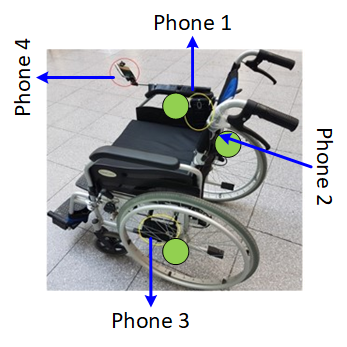
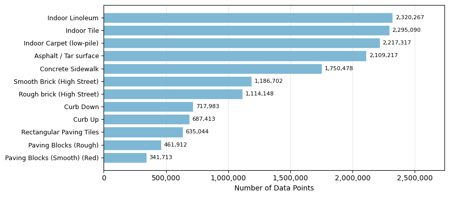
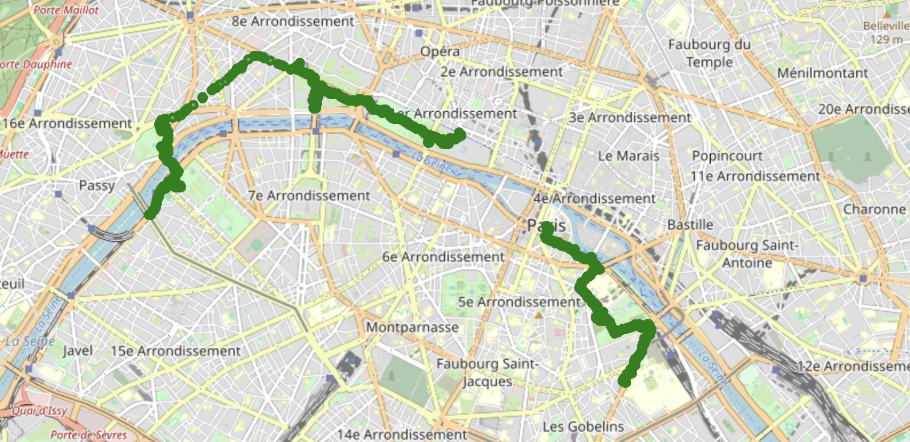
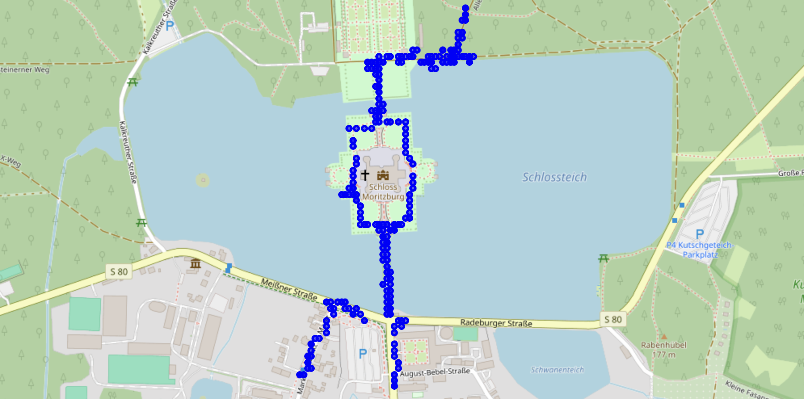

# SurfaceEncoder: Semi-Supervised Representation Learning for Global Wheelchair Accessibility

<p align="center">
  <a href="https://ecmlpkdd.org/2026/"></a>
  <a href="LICENSE.txt"></a>
  <a href="LICENSE-CC-BY-4.0.txt"></a>
  
  
</p>

<p align="center">
  
</p>

## Highlights

- **GWS Dataset** — 52M IMU data points across USA, Vietnam, Austria, France, and Germany collected from real wheelchair users in controlled and naturalistic settings.
- **SurfaceEncoder** — novel autoencoder with MSTCB + CAIM + FAAG architecture tailored to multi-axis vibration signals from wheel–surface contact.
- **Semi-supervised transfer** — +32% clustering improvement (silhouette 0.335 → 0.443) by leveraging labeled cross-continental data on unlabeled European routes.
- **Foundation model benchmark** — comprehensive ablation against TS2Vec, Chronos, MOMENT, and TimesFM on the same dataset.
- **Live deployment** — powers a real-time LLM-based turn-by-turn accessible navigation system.

---

## Global Wheelchair Surface (GWS) Dataset

### Overview

| Subset                  | Geography           |  Duration | Data Points | Labels | GPS |
| :---------------------- | :------------------ | --------: | ----------: | :----: | :-: |
| Labeled controlled      | USA + Vietnam       |    13.6 h |      ~9.5 M |   ✓    |  ✗  |
| Unlabeled urban transit | Europe (AT, FR, DE) |    ~170 h |       ~43 M |   ✗    |  ✓  |
| **Total**               | **5 countries**     | **183 h** |    **52 M** |   —    |  —  |

### Surface Classes

The labeled subset covers 12 distinct surface types encountered in real urban wheelchair use:

| ID  | Surface Type                 | Regions      |
| :-: | :--------------------------- | :----------- |
|  1  | Paving Blocks — Smooth (Red) | USA, Vietnam |
|  2  | Concrete Sidewalk            | USA          |
|  3  | Smooth Brick (High Street)   | USA          |
|  4  | Rough Brick (High Street)    | USA          |
|  5  | Asphalt / Tar Surface        | USA, Vietnam |
|  6  | Indoor Carpet (Low-pile)     | USA          |
|  7  | Indoor Linoleum              | USA          |
|  8  | Indoor Tile                  | USA, Vietnam |
|  9  | Curb Up                      | USA          |
| 10  | Curb Down                    | USA          |
| 11  | Rectangular Paving Tiles     | Vietnam      |
| 12  | Paving Blocks — Rough        | Vietnam      |

<p align="center">
  
  <br/><em>Data point distribution across surface classes.</em>
</p>

### Collection Protocol

Data was recorded by mounting consumer smartphones (Samsung Galaxy S7, Samsung Galaxy J7, Motorola Moto G7/G8/G9) to manual wheelchairs. Labeled sessions used fixed routes on target surfaces with manual surface annotation. Unlabeled sessions captured continuous naturalistic wheelchair transit across three European cities.

### Sensor Specifications

| Sensor        | Measurement                     | Unit                 |
| :------------ | :------------------------------ | :------------------- |
| Accelerometer | Linear acceleration (3-axis)    | m/s²                 |
| Gyroscope     | Angular velocity (3-axis)       | rad/s                |
| Barometer     | Atmospheric pressure / altitude | hPa                  |
| GPS           | Geospatial position             | Latitude / Longitude |

### Geographic Coverage — Unlabeled European Routes

<p align="center">
  
  &nbsp;&nbsp;
  
  <br/><em>Left: unlabeled wheelchair transit route in Paris, France. &nbsp; Right: route near Schloss Moritzburg, Germany.</em>
</p>

Interactive route maps for [Dresden, Germany](figures/Dresden.html) and [full European coverage](figures/Europe.html) are available as standalone HTML files.

---

## Environment Setup

### Requirements

- Python 3.10+
- PyTorch 2.0+ (CPU or CUDA 11.8+ / Apple MPS)
- [Anaconda](https://www.anaconda.com/download) or [Miniconda](https://docs.conda.io/en/latest/miniconda.html)

### Installation

```bash
# Clone the repository
git clone https://github.com/MU-Smart/SurfaceEncoder.git
cd SurfaceEncoder

# Create and activate conda environment
conda create -n surfaceencoder python=3.10 -y
conda activate surfaceencoder

# Install dependencies
pip install -r requirements.txt
```

**GPU (CUDA 11.8):**

```bash
conda install pytorch torchvision torchaudio pytorch-cuda=11.8 -c pytorch -c nvidia -y
```

**Apple MPS (macOS):** no extra step — PyTorch from `requirements.txt` includes MPS support.

---

## Usage

### 2. Train SurfaceEncoder

```bash
python src/surface_encoder.py
```

The script runs end-to-end:
1. Loads windowed labeled + unlabeled CSVs from `data/features/`
2. Z-normalises per-window per-channel; stratified 80/20 split
3. Trains SurfaceEncoder (log-cosh reconstruction + auxiliary classification loss)
4. Saves best checkpoint to `surface_encoder_best.pth`
5. Extracts embeddings → PCA → 8-method clustering
6. Evaluates on test split (Silhouette, Davies-Bouldin, CH, ARI, NMI, Dunn)
7. Saves t-SNE + UMAP visualisations, diagnostic plots, and unlabeled cluster assignments

Key hyperparameters are in `CONFIG` at the top of `src/surface_encoder.py`.

### 4. Run Baselines

Each baseline is self-contained:

```bash
python baselines/chronos.py              # Chronos embedding + clustering
python baselines/moments.py             # MOMENT embedding + clustering
python baselines/timesfm.py             # TimesFM embedding + clustering
python baselines/ts2vec.py              # TS2Vec + clustering
python baselines/handcrafted_features.py # Statistical features + clustering
```

All baselines share the same evaluation protocol and produce comparable metric tables.

---

## Data Format Reference

### Labeled Files — Raw (`data/raw/labeled/`)

`YYYY-MM-DD_SurfaceTypeID_X_DeviceModel_expN_subjectN.csv`

| Column                          | Description                | Unit  |
| :------------------------------ | :------------------------- | :---- |
| `timestamp`                     | Unix epoch or elapsed time | ms    |
| `accel_x`, `accel_y`, `accel_z` | 3-axis linear acceleration | m/s²  |
| `gyro_x`, `gyro_y`, `gyro_z`    | 3-axis angular velocity    | rad/s |
| `pressure`                      | Atmospheric pressure       | hPa   |

### Unlabeled Files — Raw (`data/raw/unlabeled/`)

`<LocationName>_GPSData.csv`

Same columns as above plus `latitude`, `longitude` (GPS available for the unlabeled European subset only).

### Pre-extracted Windows (`data/features/`)

| Column                       | Description                         |
| :--------------------------- | :---------------------------------- |
| `window_id`                  | Integer window index                |
| `surface_id`                 | Surface class label (0 = unlabeled) |
| `valueX`, `valueY`, `valueZ` | Per-timestep accelerometer axes     |

---

## Citation

> **Note:** This paper has been accepted at ECML PKDD 2026 and is not yet available on Springer. Citation will be updated upon publication.

If you use the GWS dataset, SurfaceEncoder, or the benchmarking code, please cite:

```bibtex
@inproceedings{mahmud2026surfaceencoder,
  title     = {SurfaceEncoder: Semi-Supervised Representation Learning
               for Global Wheelchair Accessibility},
  author    = {Mahmud, Nadim and Raychoudhury, Vaskar and
               Gani, Md Osman and Saha, Snehanshu},
  booktitle = {Proceedings of the European Conference on Machine Learning
               and Principles and Practice of Knowledge Discovery
               in Databases (ECML PKDD)},
  year      = {2026},
  note      = {To appear},
}
```

---

## License

| Artifact                           | License                                                               |
| :--------------------------------- | :-------------------------------------------------------------------- |
| Source code (`src/`, `baselines/`) | [MIT](LICENSE.txt)                                                    |
| GWS Dataset (`data/`)              | [Creative Commons Attribution 4.0 (CC BY 4.0)](LICENSE-CC-BY-4.0.txt) |

Under **CC BY 4.0**, you may share and adapt the dataset for any purpose, provided appropriate credit is given and changes are indicated.

---

<p align="center">
  <a href="https://github.com/MU-Smart/SurfaceEncoder">github.com/MU-Smart/SurfaceEncoder</a>
</p>
